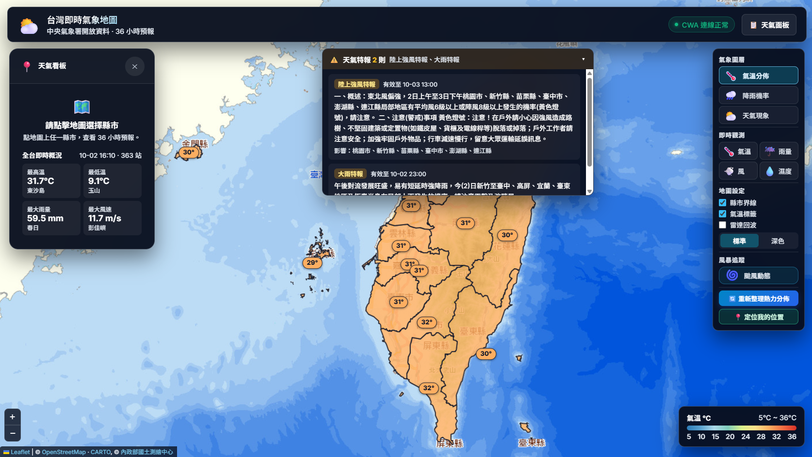

# Taiwan Weather Forecast 台灣縣市氣象 Dashboard

> **課程名稱**：AIoT 與數據分析（AIoT & Data Analytics, AIoT-DA）  
> **HW1**: CWA 天氣預報網站 using AI Agent  
> **學生**：葉文賢  
> **學號**：5115056038  
> **儲存庫位置**：https://github.com/RyanYeh57/L3_CWAv2  
> **Live Demo Page**：https://l3-taiwan-weather.vercel.app/

---



## 專案特色

- **互動式台灣地圖**：以 Leaflet 搭配 22 縣市 GeoJSON 邊界（含澎湖、金門、馬祖），底圖為 CARTO 與內政部國土測繪中心電子地圖，支援 Hover 高亮與點擊查詢。
- **36 小時縣市預報**：氣溫、降雨機率、天氣現象三種圖層，以彩色溫度標籤呈現，放大地圖後顯示縣市名稱。
- **即時觀測**：全台約 360 個測站的氣溫、今日雨量、風速風向、相對濕度，並提供全台最高溫、最低溫、最大雨量、最大風速統計。
- **天氣特報**：顯示中央氣象署發布的大雨、強風等特報與影響縣市。
- **颱風動態**：呈現颱風路徑、風圈與預報時間軸，可播放路徑動畫。
- **雷達回波、底圖切換、定位**：疊加 RainViewer 雷達圖，可切換標準／深色底圖，並一鍵定位到使用者所在位置。
- **快取機制**：預報資料快取於 SQLite；即時觀測、特報、颱風資料以記憶體快取 10 分鐘，減少重複的外部請求。
- **動態條狀圖 (Bar Chart)**：採用純 CSS Flexbox 與動態百分比換算，即時渲染最高溫、最低溫與降雨機率，支援多時段預報卡片展示。
- **健全錯誤處理與防護**：處理無效縣市、未配置 API Key、網路異常或資料庫錯誤，並提供標準繁體中文錯誤提示。
- **RWD 佈局**：深色玻璃擬態風格（Glassmorphism）浮動面板；行動端圖層面板收合為按鈕，天氣面板改為底部抽屜。

---

## 技術棧

| 領域 | 技術 / 工具 |
|---|---|
| **後端核心** | Python 3.12+ / FastAPI / Uvicorn / httpx |
| **資料庫** | SQLite 3 (`sqlite3`) |
| **環境管理** | python-dotenv |
| **前端設計** | HTML5 / Vanilla CSS3 / JavaScript (ES6+) |
| **地圖視覺化** | Leaflet 1.9.4 / GeoJSON / CARTO / 國土測繪中心 EMAP |
| **資料來源** | CWA OpenData（`F-C0032-001`、`O-A0003-001`、`W-C0033-002`、`W-C0034-005`）/ RainViewer |
| **部署** | Vercel |
| **測試框架** | pytest / TestClient |

---

## 專案結構

```text
L3_CWAv2/
├── main.py                     # FastAPI 應用程式主入口與 API 路由
├── services/
│   ├── weather.py              # CWA 36 小時預報 API 呼叫、JSON 解析與快取協調
│   ├── database.py             # SQLite 資料庫 CRUD 操作與 Schema 管理
│   ├── observation.py          # CWA 即時測站觀測資料與全台統計
│   ├── warnings.py             # CWA 天氣特報
│   └── typhoon.py              # CWA 颱風路徑與風圈資料
├── data/
│   └── cities.py               # 台灣 22 縣市常數與名稱正規化
├── database/
│   └── weather.db              # SQLite 資料庫快取檔案 (.gitignore 排除)
├── templates/
│   └── index.html              # 前端主頁面 HTML
├── static/
│   ├── style.css               # 樣式表 (Glassmorphism & RWD)
│   ├── app.js                  # 前端地圖、圖層、API 請求與長條圖邏輯
│   ├── taiwan_counties.geojson # 台灣 22 縣市邊界
│   └── taiwan-map.svg          # 台灣 22 縣市向量地圖
├── tests/
│   └── test_all.py             # 全模組自動化單元與整合測試
├── docs/                       # 架構、資料庫與 API 規格文檔
├── .agent/                     # Agent 開發與驗收工作流程 (Workflows)
├── .env.example                # 環境變數設定範例檔
├── .gitignore                  # Git 排除清單 (.env, *.db 等)
├── requirements.txt            # Python 相依套件清單
├── course-poster.md            # 課程海報內容整理
├── spec.md                     # 規格說明書
├── plan.md                     # 實作計畫書
├── verify.md                   # 驗證規範
├── verification-report.md      # 驗收標準檢驗報告
└── README.md                   # 本說明文件
```

---

## 快速開始

### 1. 安裝環境依賴

建議使用 Python 3.12+ 環境，執行以下指令安裝所需套件：

```bash
pip install -r requirements.txt
```

### 2. 配置環境變數

複製 `.env.example` 為 `.env`，並填入中央氣象署 CWA OpenData 授權碼：

```bash
cp .env.example .env
```

編輯 `.env` 內容：

```ini
CWA_API_KEY=你的_CWA_API_授權碼
```

> 若無 API Key，單一縣市查詢在 SQLite 快取中若有預報仍可正常展示；若無快取則會回傳標準提示「系統尚未設定 CWA_API_KEY」。

### 3. 啟動服務

執行以下指令啟動 FastAPI 本機伺服器：

```bash
python main.py
```

或使用 uvicorn 指令：

```bash
uvicorn main:app --reload --host 127.0.0.1 --port 8000
```

開啟瀏覽器造訪：`http://127.0.0.1:8000`

---

## 部署到 Vercel

1. 將專案推送到 GitHub。
2. 在 [Vercel](https://vercel.com/new) 匯入此儲存庫（Vercel 會自動偵測 `main.py` 中的 FastAPI `app`）。
3. 於 **Settings → Environment Variables** 新增 `CWA_API_KEY`。
4. 按下 Deploy。之後推送到 `main` 分支會自動重新部署。

> Vercel 只允許寫入 `/tmp`，因此偵測到 `VERCEL` 環境變數時，SQLite 會改存於 `/tmp/weather.db`。此檔案可能被平台清除，屆時會自動向 CWA 重新取得資料。

---

## API 端點規格

| 方法 | 端點路徑 | 說明 |
|---|---|---|
| `GET` | `/` | 回傳前端氣象儀表板首頁 |
| `GET` | `/api/cities` | 取得台灣標準 22 縣市清單 |
| `GET` | `/api/weather` | 取得全台縣市預報摘要 |
| `GET` | `/api/weather/{city_name}` | 取得指定縣市 36 小時預報 |
| `GET` | `/api/observations` | 取得全台測站即時觀測與統計 |
| `GET` | `/api/warnings` | 取得天氣特報 |
| `GET` | `/api/typhoons` | 取得颱風路徑與風圈資料 |

詳細的回應格式請參閱 [`docs/api.md`](./docs/api.md)。

---

## 自動化測試

執行 pytest 執行全套件測試（包含資料庫 CRUD、CWA JSON 解析器、即時觀測與特報解析、FastAPI 端點與前端資產完整性）：

```bash
python -m pytest tests/test_all.py -v
```

---

## 驗收標準對照

本專案經過嚴格依照 `spec.md` 與 `verify.md` 進行逐項檢驗（參閱 `verification-report.md`）：
- 22 個縣市點擊與選取功能完整正常。
- 首頁載入時一次取得全台預報並繪製溫度分佈；點擊縣市後再載入該縣市的詳細時段預報。
- 動態計算長條圖，支援多時間區間展開。
- `.env` 確實被 `.gitignore` 排除，絕無洩漏至 Git 追蹤。
